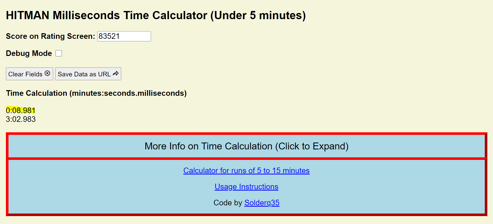
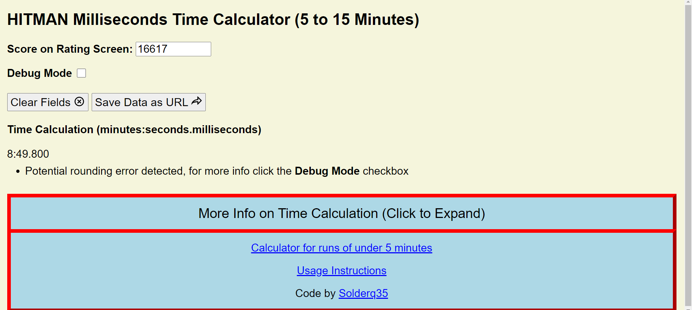
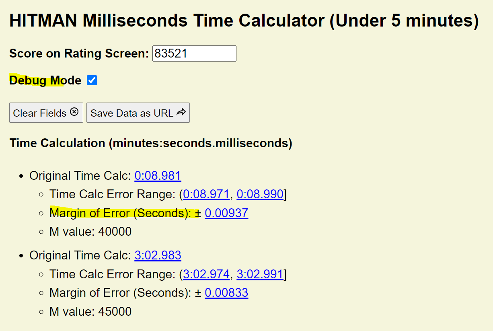

# HITMAN Milliseconds Time Calculator

## Site URL (Try it Yourself!)

- Production Deployment URL: https://solderq35.github.io/time-calc-under-5/
- Test Deployment URL: https://time-calc-under-5.s3.us-west-2.amazonaws.com/index.html

Don't like using a website? Check our **[Discord Bot Version of This](https://github.com/solderq35/timmy-mk-3)**

### Site Setup

- Install Dependencies: `npm i`
- Code Formatting: `npm run prettier`
- Open static HTML files in browser for local development

### Deployment Details

- Test Deployment is triggered by pull requests to main branch (see `.github/workflows/test-build-s3.yml`)
  - Currently no JS library dependencies, so just upload entire repo (minus what's in gitignore) to s3
- Production Deployment is triggered by pushes to main branch. It is handled by default GitHub Pages integration (Jeykyll?), not by a workflow file

## About

Tool for calculating in-game time milliseconds for HITMAN level speedruns, **with an estimated 20 regular users among the HITMAN speedrun community**.

### Technologies Used:

- Lightweight site built with vanilla Javascript, HTML, CSS.
- Deployed on Github Pages
- Markdown to HTML (for syncing readme and "more info" pane on site): https://markdowntohtml.com/

### Usage Instructions and Screenshots

1.  Most video examples from [here](https://www.youtube.com/results?search_query=hitman+3+speedrun&sp=EgIYAQ%253D%253D) or [here](https://www.speedrun.com/hitman_3) will work for getting the right inputs if you have trouble finding applicable Hitman speedrun videos.
2.  For this example, let's use [this video](https://www.youtube.com/watch?v=zIRAmZdl-y4), which is an 8 second run of the "On Top of the World" Hitman level.
3.  We can see that the end of this video that the score at the end of the video is `83,521`. As shown here: 
4.  Now, let's enter `83521` into the "Score" input field on the Milliseconds Calculator Site. 
5.  Voila! As you can see, the bot returns a few viable solutions. One of them (8.981) is within a second of the 8 seconds value shown on the rating screen, so this is the milliseconds value we are looking for. Click on **More Info on Time Calculation** to get more insight on the mathematics behind this site.
6.  In case of rounding errors, you will get a warning, as shown below (example: `!time 204667`):

7.  As prompted, click the **Debug Mode** checkbox. Each link will take you to the exact calculation ([example for "margin of error" below](https://www.google.com/search?q=%280.5+*+100000+%2F+40000%29+*+%283+%2F+400%29)) via Google Search Query.
    
8.  You can also click on **Save Data as URL** to copy a URL to your clipboard that contains the score input you used and whether or not you had Debug Mode on.
9.  A last option to consider is the **Calculator for 5 to 15 minutes** option, as the score-to-milliseconds formula changes after 5 minutes.

### Mathematics/ Code Explanation

The full mathematical formula for calculating in game time from score, for runs of less than 5 minutes in-game time, is:

**(210,000 - (N \* 100,000 / M)) \* (3 / 400)**

The full mathematical formula for calculating in game time from score, for runs of 5 to 15 minutes, is:

**(175,000 - (N \* 100,000 / M)) \* (3 / 50)**

Let N = The Score shown on screen.  
Let M = The Bonuses and Penalties added up.

Each Silent Assassin Bonus (Objectives Complete, Never Spotted, No Noticed Kills, No Bodies Found, No Recordings) is 20k points towards the M value, while each nontarget kill is -5k points towards the M value. Note that the Time Bonus does not count towards the M value. The maximum M value is 100,000.

[If confused by terminology in above paragraph, refer to this reference image of Detailed Score (press P on a Hitman mission rating screen to get to this menu in-game)](https://i.ibb.co/BPPf3wn/detailedscore.png)

Since most players do not show Detailed Score Menu in their run submissions, this site runs a script to account for all 20 possible M values, and calculates 20 possible decimal times as a result. The user is asked to report the the time shown on the rating screen (which rounds down to the nearest second). The calculated decimal time that is closest to the time shown on the rating screen is displayed to the user.

### Usage Quirks

- This formula does not work when the N value (Score) and/or M value (Penalties/Bonuses) are 0. Note that one of the Silent Assassin bonuses is "Objectives Complete", and you are almost guaranteed to get points for this simply by killing all targets and exiting the mission. The score can become 0 either due to:

- Killing too many nontargets (each nontarget kill is -5k in the Bonuses and Penalties (M) score).
- Finishing the mission in less than 7 seconds (IOI's "anticheat", currently this only applies to Dubai any% in terms of main missions).

- Any decimal values smaller than a millisecond in the final result are rounded down to the nearest millisecond.
  - Example: 26.1857 rounds down to 26.185.

### Error Calculation

- Disclaimer: The calculated decimal score is not quite accurate (due to the game internally tracking decimals in the score). These can be manually rounded to the next fastest second as needed for leaderboard purposes.
  - To be precise: **Error = (Z \* 100,000 / M) \* (3 / 400)**
    - Where M = the penalties and bonuses added up (each SA bonus 20k, each nontarget kill -5k, etc).
    - And Z = how much the score shown on screen is off, between -0.5 and 0.5.
  - Assuming -0.5 < Z <= 0.5, the error can be as low as ±0.00375 seconds (for SA run) or as high as ±0.75 seconds (any% run with M score of 5k).
  - Example (calculated time is higher than expected):
    - SCORE (N): 113593
      - **Actual Score Screen**: 0:25.xxx
      - Original Time Calc: [0:26.004](https://www.google.com/search?q=%28210000+-+%28113593+*+100000+%2F+55000%29%29+*+%283+%2F+400%29)
      - Time Calc Error Range: ([0:25.997](https://www.google.com/search?q=%28210000+-+%28113593.5+*+100000+%2F+55000%29%29+*+%283+%2F+400%29), [0:26.011](https://www.google.com/search?q=%28210000+-+%28113592.5+*+100000+%2F+55000%29%29+*+%283+%2F+400%29))
      - Margin of Error (Seconds): ± [0.00681](https://www.google.com/search?q=%280.5+*+100000+%2F+55000%29+*+%283+%2F+400%29)
      - M value: 55000
      - **Result for SRC**: Due to the time shown on rating screen taking precedent, use 25.999 for leaderboard ranking (if using milliseconds)
  - Example (calculated time is lower than expected):
    - SCORE: 204667
      - **Actual Time shown on Rating Screen**: 40.xxx
      - Original Time Calc: [0:39.997](https://www.google.com/search?q=%28210000+-+%28204667+*+100000+%2F+100000%29%29+*+%283+%2F+400%29)
      - Time Calc Error Range: ([0:39.993](https://www.google.com/search?q=%28210000+-+%28204667.5+*+100000+%2F+100000%29%29+*+%283+%2F+400%29), [0:40.001](https://www.google.com/search?q=%28210000+-+%28204666.5+*+100000+%2F+100000%29%29+*+%283+%2F+400%29)]
      - Margin of Error (Seconds): ± [0.00375](https://www.google.com/search?q=%280.5+*+100000+%2F+100000%29+*+%283+%2F+400%29)
      - M value: 100000
      - **Result for SRC (tentative)**: Due to the time shown on rating screen taking precedent, use 40.000 for leaderboard ranking (if using milliseconds)
      - PS: This case seems to confirm that the score rounds up to the next value, with a rounding cutoff near .5 mark (score decimals of less than .5 = round down, greater than or equal to .5 = round up)
